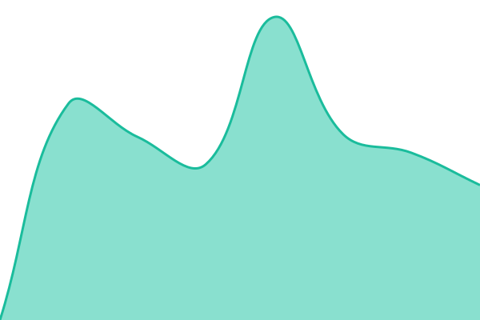

# [📈 Live Status](https://status.boadtech.com): <!--live status--> **🟥 Complete outage**

This repository contains the open-source uptime monitor and status page for [Adeogo Emmanuel Oladipo](https://status.boadtech.com), powered by [Upptime](https://github.com/upptime/upptime).

With [Upptime](https://upptime.js.org), you can get your own unlimited and free uptime monitor and status page, powered entirely by a GitHub repository. We use [Issues](https://github.com/OlaAde/boadtech-statuspage/issues) as incident reports, [Actions](https://github.com/OlaAde/boadtech-statuspage/actions) as uptime monitors, and [Pages](https://status.boadtech.com) for the status page.

<!--start: status pages-->
<!-- This summary is generated by Upptime (https://github.com/upptime/upptime) -->
<!-- Do not edit this manually, your changes will be overwritten -->
<!-- prettier-ignore -->
| URL | Status | History | Response Time | Uptime |
| --- | ------ | ------- | ------------- | ------ |
|  [Sentola Website](https://www.sentola.ru) | 🟥 Down | [sentola-website.yml](https://github.com/OlaAde/boadtech-statuspage/commits/HEAD/history/sentola-website.yml) | 

 1730ms
     
 | 

<a href="https://OlaAde.github.io/boadtech-statuspage/history/sentola-website">84.38%</a>
    

|  [Sentola Dashboard](https://app.sentola.ru) | 🟥 Down | [sentola-dashboard.yml](https://github.com/OlaAde/boadtech-statuspage/commits/HEAD/history/sentola-dashboard.yml) | 

 2179ms
     
 | 

<a href="https://OlaAde.github.io/boadtech-statuspage/history/sentola-dashboard">84.39%</a>
    

|  [Sentola Backend](https://api.sentola.ru/) | 🟥 Down | [sentola-backend.yml](https://github.com/OlaAde/boadtech-statuspage/commits/HEAD/history/sentola-backend.yml) | 

 7061ms
     
 | 

<a href="https://OlaAde.github.io/boadtech-statuspage/history/sentola-backend">84.39%</a>
    

|  [Invest Sentola](https://invest.sentola.ru) | 🟥 Down | [invest-sentola.yml](https://github.com/OlaAde/boadtech-statuspage/commits/HEAD/history/invest-sentola.yml) | 

 2675ms
     
 | 

<a href="https://OlaAde.github.io/boadtech-statuspage/history/invest-sentola">84.39%</a>
    

|  [Sentola Admin](https://admin.sentola.ru) | 🟥 Down | [sentola-admin.yml](https://github.com/OlaAde/boadtech-statuspage/commits/HEAD/history/sentola-admin.yml) | 

 2152ms
     
 | 

<a href="https://OlaAde.github.io/boadtech-statuspage/history/sentola-admin">84.39%</a>
    

|  [Trackr Backend (Conversion API)](https://api.tradetrackr.ru/api/open/convert) | 🟥 Down | [trackr-backend-conversion-api.yml](https://github.com/OlaAde/boadtech-statuspage/commits/HEAD/history/trackr-backend-conversion-api.yml) | 

 20869ms
     
 | 

<a href="https://OlaAde.github.io/boadtech-statuspage/history/trackr-backend-conversion-api">84.39%</a>
    

<!--end: status pages-->

[**Visit our status website →**](https://status.boadtech.com)

## 📄 License

- Powered by: [Upptime](https://github.com/upptime/upptime)
- Code: [MIT](./LICENSE) © [Anand Chowdhary](https://anandchowdhary.com), supported by [Pabio](https://pabio.com)
- Data in the `./history` directory: [Open Database License](https://opendatacommons.org/licenses/odbl/1-0/)
